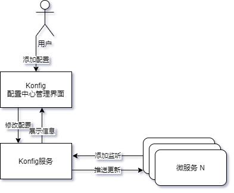
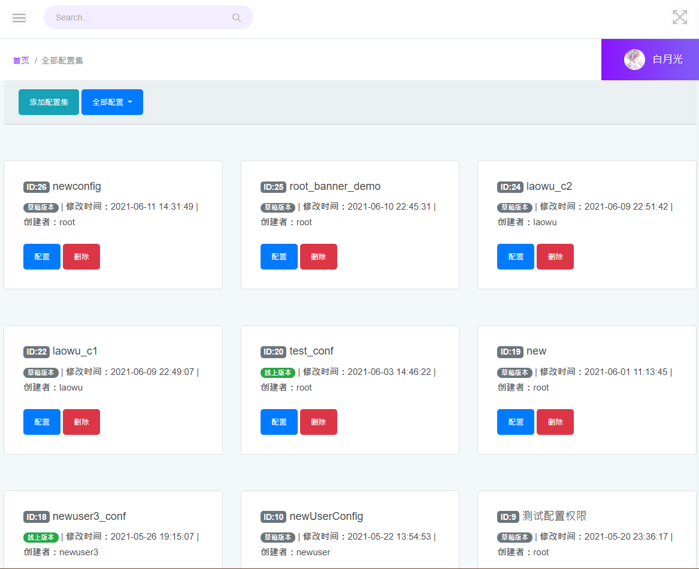
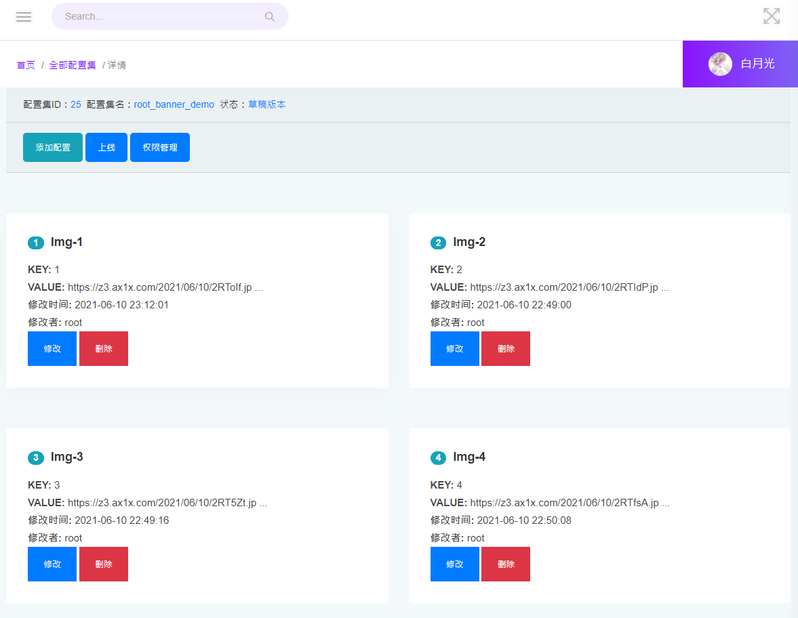
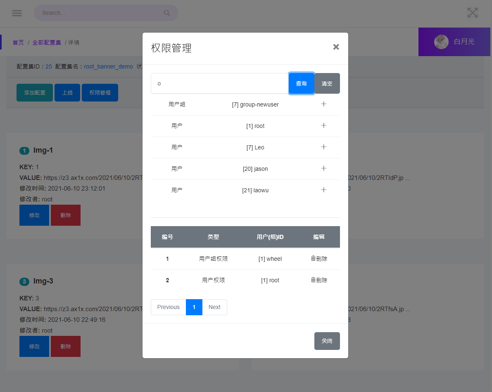
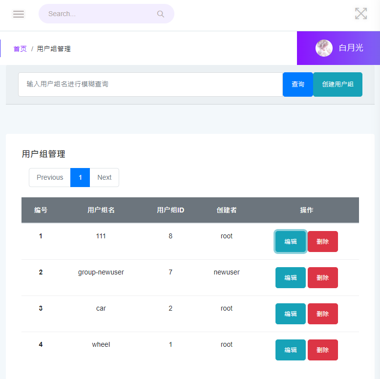
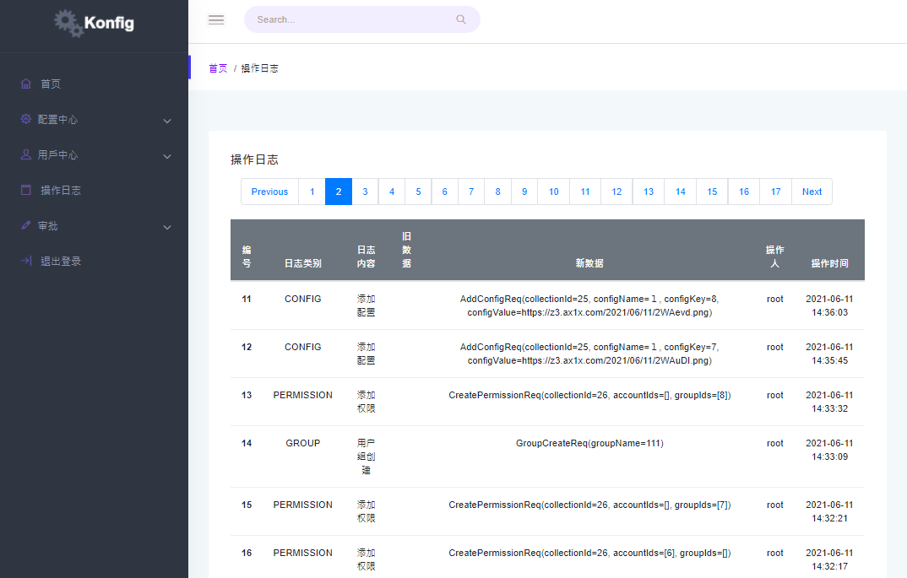
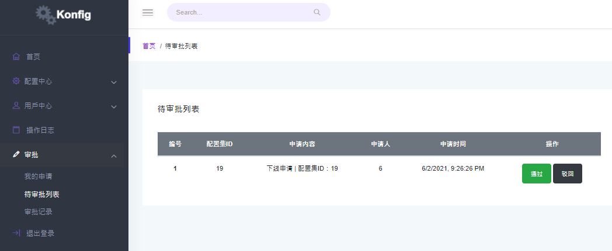

# 配置管理中心 konfig

<!-- START doctoc generated TOC please keep comment here to allow auto update -->
<!-- DON'T EDIT THIS SECTION, INSTEAD RE-RUN doctoc TO UPDATE -->


- [配置管理中心 konfig](#%E9%85%8D%E7%BD%AE%E7%AE%A1%E7%90%86%E4%B8%AD%E5%BF%83-konfig)
  - [一、Introduce - 介绍](#%E4%B8%80introduce---%E4%BB%8B%E7%BB%8D)
    - [概要](#%E6%A6%82%E8%A6%81)
    - [特性](#%E7%89%B9%E6%80%A7)
    - [截图](#%E6%88%AA%E5%9B%BE) 
  - [二、Docker deployment](#二docker-deployment)

  - [三、Runtime Environment - 运行环境](#三runtime-environment---%E8%BF%90%E8%A1%8C%E7%8E%AF%E5%A2%83)
    - [Zookeeper单机部署](#zookeeper%E5%8D%95%E6%9C%BA%E9%83%A8%E7%BD%B2)
    - [Redis 部署](#redis-%E9%83%A8%E7%BD%B2)
    - [Java环境](#java%E7%8E%AF%E5%A2%83)
    - [安装Maven](#%E5%AE%89%E8%A3%85maven)
    - [Kafka单机部署](#kafka%E5%8D%95%E6%9C%BA%E9%83%A8%E7%BD%B2)
    - [Git](#git)
    - [MySQL](#mysql)
  - [四、Usage - 用法](#四usage---用法)
    - [MySQL](#mysql-1)
    - [后端程序部署](#%E5%90%8E%E7%AB%AF%E7%A8%8B%E5%BA%8F%E9%83%A8%E7%BD%B2)
    - [前端项目部署](#%E5%89%8D%E7%AB%AF%E9%A1%B9%E7%9B%AE%E9%83%A8%E7%BD%B2)
  - [五、Changelog - 更新日志](#%E4%BA%94changelog---%E6%9B%B4%E6%96%B0%E6%97%A5%E5%BF%97)
  - [六、FAQ - 常见问题](#%E5%85%ADfaq---%E5%B8%B8%E8%A7%81%E9%97%AE%E9%A2%98)
  - [七、License - 版权信息](#%E4%B8%83license---%E7%89%88%E6%9D%83%E4%BF%A1%E6%81%AF)

<!-- END doctoc generated TOC please keep comment here to allow auto update -->


## 一、Introduce - 介绍

### 概要

> - 微服务配置中心Konfig是一个配置集中化管理组件。
> - 包括两部分组成：管理系统、Java开发SDK。




### 特性

 - 配置权限管理机制
 - 配置 / 配置集 管理
 - Java开发SDK（配置变更监听、获取配置）
 - 用户、用户组管理
 - 配置上线审核机制
 - 多用户、用户组配置相互隔离
 - 操作记录可追溯
 
### 截图

**配置集合**

**配置详情**

**配置权限管理**

**用户组管理**

**操作日志**

**上线/下线审核**

## 二、Docker Deployment
**Try it by using docker!**

1. Pull mariadb image, then deploy it.
	1. `docker pull mariadb`
	2. `docker run --detach --name mariadb --env MARIADB_USER=test_user --env MARIADB_PASSWORD=123456 --env MARIADB_ROOT_PASSWORD=123456 mariadb:latest`
2. Run [konfig](https://hub.docker.com/r/leisurelybear/konfig) service using docker
	1. `docker pull leisurelybear/konfig:1.2`
	2. `docker run -itd -p 80:80 --link mariadb konfig:1.2 /bin/bash /app/setup.sh`

## 三、Runtime Environment - 运行环境

###  Zookeeper单机部署
(1) 从官方镜像分流下载zookeeper

```shell
$ wget https://mirrors.tuna.tsinghua.edu.cn/apache/zookeeper/zookeeper-3.7.0/apache-zookeeper-3.7.0-bin.tar.gz
```

(2) 解压。
```shell
$ tar -zxvf apache-zookeeper-3.7.0-bin.tar.gz
```
(3) 运行Zookeeper。
```shell
$ cd apache-zookeeper-3.7.0-bin/conf/ # 进入zk的配置目录
$ cp zoo_sample.cfg zoo.cfg # 复制一份配置文件
$ cd ../bin # 进入zk的bin目录
$ ./zkServer.sh start # 启动zkServer
```


### Redis 部署

> 两种方法：
>
> 1、通过下载源码，编译安装，需要事先安装编译工具 gcc gcc-c++ kernel-devel
>
> 2、直接通过yum安装，这里选择第二个方式

(1) 安装Redis

```shell
$ yum search redis # 先搜一下redis，如果有可以安装，没有的话只能编译安装
$ sudo yum -y install redis.x86_64 # 安装
```

(2) 修改配置

```shell
# 修改配置，允许远程访问，设置密码
$ sudo vim /etc/redis.conf
```

```properties
# /etc/redis.conf

# protected-mode yes
protected-mode no # 关闭保护模式
# requirepass foobared
requirepass 123456 # 这里设置自己的密码
```


(3) 启动redis

```shell
$ redis-server # 或者在后台运行 $ nohup redis-server > redis.log 2>&1 & 
```

> - 当然，我们可以写一个脚本，在后台运行
>
> ```
> #!/bin/bash
> nowtime=$(date +%Y-%m-%d__%H-%M)
> nohup redis-server > redis.$nowtime.log 2>&1 &
> ```
>
> 
>
> - 停止运行
>
>   ps -aux | grep redis
>
>   kill -9 {上一步展示的pid}

### Java环境

> 这里使用华为云的jdk8源

(1) 卸载openJDK

```shell
# 一般默认会有openJDK，先卸载
$ rpm -qa|grep java # 列出安装的openjdk
$ rpm -e --nodeps java-1.8.0-openjdk-headless-1.8.0.101-3.b13.el7_2.x86_64 # 把有关openjdk字样的都删除了就可以了
```

(2) 安装Oracle JDK

```shell
# 安装oracle的jdk
$ wget https://mirrors.huaweicloud.com/java/jdk/8u151-b12/jdk-8u151-linux-x64.rpm
$ sudo rpm -i jdk-8u151-linux-x64.rpm # 安装rpm
$ java -version # 查看安装成功的版本号
```


### 安装Maven

(1) 下载安装maven

```shell
$ wget https://mirrors.tuna.tsinghua.edu.cn/apache/maven/binaries/apache-maven-3.2.2-bin.tar.gz
$ tar -zxvf apache-maven-3.2.2-bin.tar.gz
```

(2) 配置Maven镜像源

```shell
$ vim apache-maven-3.2.2/conf/settings.xml # 编辑配置文件，加入下面内容
```

```xml
  <mirrors>
	<mirror>
  		<id>aliyunmaven</id>
  		<mirrorOf>*</mirrorOf>
  		<name>阿里云公共仓库</name>
  		<url>https://maven.aliyun.com/repository/public</url>
	</mirror>
  </mirrors>
```

(3) 配置环境变量

```shell
$ sudo vim /etc/profile # 编辑文件
```

```shell
# 编辑文件，在末尾添加下面内容，保存
export PATH=$PATH:/path/to/apache-maven-3.2.2/bin
```

```shell
# 生效
$ sudo source /etc/profile
```


### Kafka单机部署

(1) 下载安装

```shell
$ wget https://downloads.apache.org/kafka/2.8.0/kafka_2.13-2.8.0.tgz
$ tar -xzf kafka_2.13-2.8.0.tgz
$ cd kafka_2.13-2.8.0
```

(2) 配置

```shell
$ vim kafka_2.13-2.8.0/config/server.properties
```

```properties
# kafka_2.13-2.8.0/config/server.properties 文件

# 配置zookeeper的地址
zookeeper.connect=localhost:2181

# 配置允许自动创建主题
auto.create.topics.enable=true

# 配置监听 ip端口号，这里也可以配置集群
advertised.listeners=PLAINTEXT://10.255.254.152:9092

# 如果是集群，需要注意broker区分
```

(3) 运行

```shell
$ nohup bin/kafka-server-start.sh config/server.properties > kafka-run.log 2>&1 & # 日志输出到文件kafka-run.log
```


### Git

```shell
$ yum -y install git
```


### MySQL

```shell
# 安装MariaDB
$ sudo yum -y install mariadb mariadb-server

# 启动MariaDB
$ sudo systemctl start mariadb

# 设置自启动
$ sudo systemctl enable mariadb

# 初始化MySQL，包括设置密码，是否支持远程访问等等
$ mysql_secure_installation 
```


## 四、Usage - 用法

### MySQL

导入SQL文件

```shell
$ wget https://github.com/Leisurelybear/konfig/raw/master/sql/lite_config_20210608.sql
$ mysql -uroot -p # 登录mysql
$ > source path/to/lite_config_20210608.sql # 导入sql文件

```

### 后端程序部署

(1) 下载项目

```shell
# 在要部署的服务器 下载项目
$ git clone https://github.com/Leisurelybear/konfig.git
```

(2) 打包部署项目

```shell
# 进入项目目录
$ cd konfig

# maven打包项目
$ mvn mvn clean package -Dmaven.test.skip=true

# 复制并修改 Auth 配置文件，将里面的组件和数据库都配置成自己的。
$ cp konfig-authentication-8021/src/main/resources/application.yml konfig-authentication-8021/target/
$ vim konfig-authentication-8021/target/application.yml

# 复制并修改 configservice 配置文件，将里面的组件和数据库都配置成自己的。
$ cp konfig-configservice-8301/src/main/resources/application.yml konfig-configservice-8301/target/
$ vim konfig-configservice-8301/target/application.yml


# 启动，可以参考上面提到的输出日志到文件，也可以开启两个session来启动
$ java -jar konfig-authentication-8021/target/konfig-authentication-1.0.0.jar
$ java -jar konfig-configservice-8301/target/konfig-configservice-1.0.0.jar
```


### 前端项目部署

(1) 安装 **Nginx/Apache/LNMP/LAMP** 其中之一配置好即可

(2) 将git下载项目中的 **liteconfig-web-ui** 内容放到服务器的webroot目录。

(3) 在 **liteconfig-web-ui/assets/js/common/header.js** 中配置 **AUTH_HOST** 和 **SERVICE_HOST **分别为后端项目的两个地址。

(4) 通过前端的地址访问index页面。


## 五、Changelog - 更新日志

## 六、FAQ - 常见问题

## 七、License - 版权信息

- [Apache 2 license](https://github.com/Leisurelybear/konfig/blob/master/LICENSE) 
